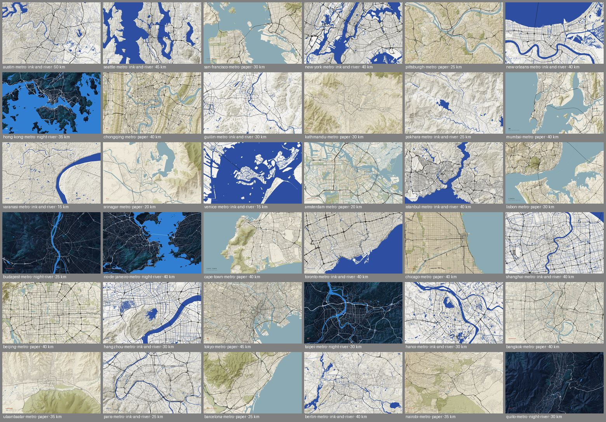
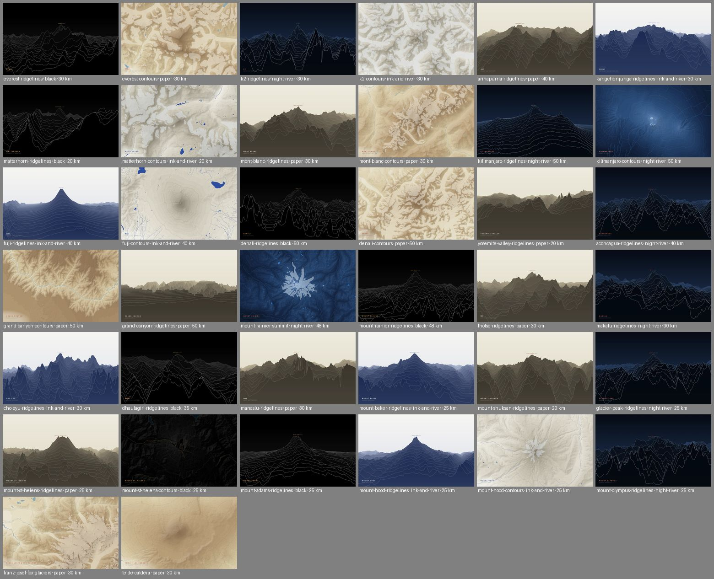

# Atlas

**Observed geography of real places.** Live at [atlas.swopnil.com](https://atlas.swopnil.com).

Atlas is an open-source generative cartography project. It turns real terrain, streets, water, parks, and other geographic data into downloadable artwork.





## What it does

- **98 pieces** in five sections: Cities, Terrain, Hydrology, Coasts & Islands, and Formations.
- **Four palettes:** Ink and River, Paper, Night River, and Black.
- **Four drawing styles:**
  - *Urban Relief:* roads by class over water, parks, and shaded terrain.
  - *Contour Fields:* filled elevation bands with contour lines and glaciers.
  - *Ridgelines:* a layered 3D view of the terrain.
  - *Water Shapes:* rivers, deltas, and wetlands, with no roads.
- **Native-script labels:** each image is titled in the place's own language, for example ཇོ་མོ་གླང་མ, 上海, or काठमाडौं.
- **Rendered in your browser.** The site is static. Previews and 3840 × 2400 PNG downloads are drawn on your device; nothing is uploaded.

## How it works

```text
views/catalog.json ──► prepare.py ──► public/data/<piece>-v1.json ──► browser renderer ──► PNG
  (place, center,       (fetch, clip,     (compact, quantized          (Canvas 2D,
   width, style)         simplify)          geometry + elevation)        deterministic)
```

1. **Catalog.** Every piece is one entry in `views/catalog.json`: a name, a native name, a center point, a width in kilometers, a style, and a default palette.
2. **Data preparation** (`tools/data/`, Python). For each piece:
   - roads, water, parks, and glaciers come from the [Protomaps](https://protomaps.com) planet build of OpenStreetMap, read with HTTP range requests;
   - elevation comes from the free [AWS Terrain Tiles](https://registry.opendata.aws/terrain-tiles/);
   - geometry is clipped, simplified for the output size, and written as one compact JSON file with a manifest of sources and licenses.
3. **Rendering** (`src/render/`, TypeScript). The same code draws the previews, the Create page, and the full-size downloads. The same data and settings always give the same image.
4. **Pages** (`tools/build-pages.mjs`). The catalog generates the section, place, and piece pages. Vite builds the site, and GitHub Actions deploys it to GitHub Pages.

The data format is documented in [docs/DATA_PIPELINE.md](docs/DATA_PIPELINE.md).

## Run it locally

Requires Node.js 22+.

```sh
npm ci
npm run dev          # http://localhost:5173
npm test
npm run build        # static site in dist/
```

## Add a place

Requires Python 3.11+.

```sh
python3 -m venv .venv
.venv/bin/pip install -r tools/data/requirements.txt

# 1. Add an entry to views/catalog.json (id, title, nativeName, center, widthKm, style, ...)
# 2. Fetch and prepare its data
.venv/bin/python tools/data/prepare.py all
# 3. If the native name uses new characters, rebuild the font subsets
.venv/bin/python tools/data/subset_fonts.py
# 4. Render its preview, then build
node tools/render-curated.mjs <piece-id>
npm run build
```

`prepare.py` skips pieces that are already prepared unless you pass `--force`, and it reports a piece that fails without stopping the run.

## Project layout

```text
views/catalog.json   every piece: place, framing, style, palette
tools/data/          Python data preparation (Protomaps, Terrain Tiles)
tools/               page generation, preview rendering, build checks
src/render/          renderer: decoding, terrain, styles, palettes, labels, PNG export
src/                 site scripts and styles
public/data/         prepared data and source manifests
public/artwork/      1280 × 800 previews
public/fonts/        Inter and Noto subsets (SIL Open Font License)
```

## Data and licenses

- **Code:** [MIT](LICENSE).
- **Map data:** © [OpenStreetMap](https://www.openstreetmap.org/copyright) contributors, under the Open Database License. Read through the Protomaps planet build.
- **Elevation:** AWS Terrain Tiles (Mapzen / Tilezen). In the United States, this is 3DEP data courtesy of the U.S. Geological Survey. Other regions use SRTM, GMTED2010, and other sources listed in each piece's manifest.
- **Fonts:** Inter and Noto, under the SIL Open Font License.

Generated images don't carry attribution text. Attribution is shown next to each download, on the [Sources](https://atlas.swopnil.com/sources/) page, and in each PNG's metadata.

The artwork license is still undecided. Until it is chosen, the code license (MIT) does not cover the artwork.
